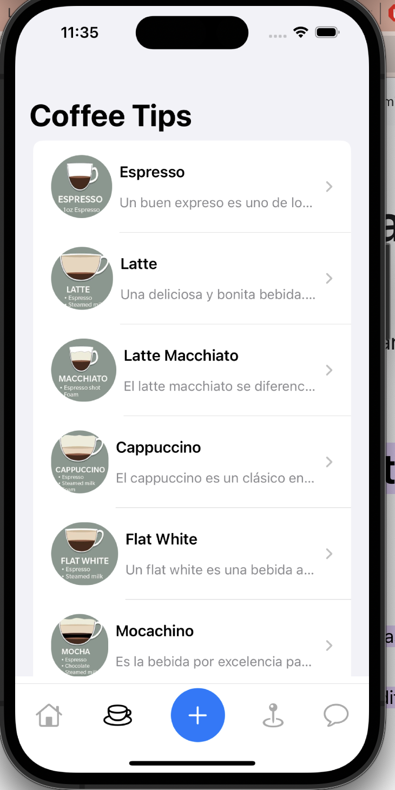

#  COFFEE SHOP IU
## This app is for coffee lovers and you can find some tips to prepare the best coffee and the best places to dring a good coffee

### Home Screen

  

### Tips Screen

  

### Tips Details Screen

  

### Places Screen

  

### Places Screen

  

## Features

- Accessibility!
- Compatible with iOS 15+ and macOS 12+.

## Technical Features

- Frontend with SwiftUI. 
- Backend with SpringBoot and with security API consumes.
- MVVM with separated layers for Data and Domain logic.

